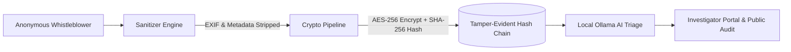
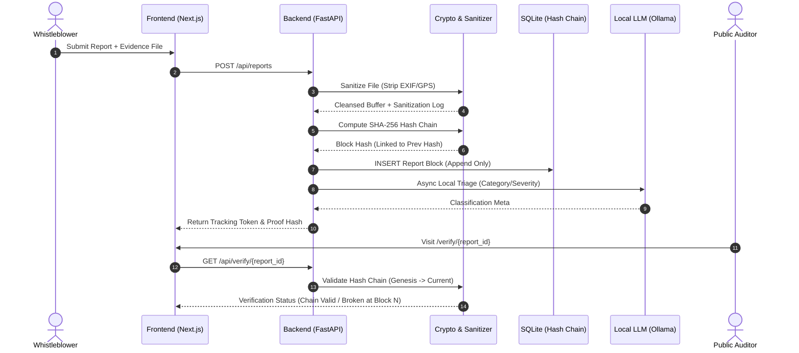

<div align="center">

# 🛡️ SafeVoice
### *Cryptographically Verifiable & Privacy-First Anonymous Reporting Platform*

[](https://github.com)
[](https://github.com)
[](https://github.com)
[](https://github.com)
[](https://github.com)

<p align="center">
  <b>Report truth without trusting a black box — trust is mathematically engineered into the system architecture.</b>
</p>

[Key Features](#-key-features) • [Architecture](#-architecture) • [Live Demo Flow](#-live-demo-flow) • [Tech Stack](#-tech-stack) • [Quick Start](#-quick-start) • [Verification System](#-public-self-service-verification)

---

</div>

## ⚡ TL;DR for Evaluators

| Feature | Description |
|---|---|
| **🚨 The Problem** | Victims avoid reporting harassment and corruption due to fear of retaliation, IP/device metadata leaks, and silent backend record deletion. |
| **💡 The Solution** | A zero-PII reporting platform featuring **automated EXIF metadata stripping**, **AES report encryption**, and an **immutable cryptographic SHA-256 hash-chain**. |
| **🔐 Structural Trust** | Trust is enforced *structurally* through schema constraints and cryptographic linking — not promised via privacy policy declarations. |
| **🤖 Edge AI Triage** | Privacy-preserving auto-triage using local LLMs (Ollama) with **zero external telemetry** and zero PII exposure. |
| **🔍 Independent Verification** | Public `/verify` portal allowing anyone to audit the integrity of the report log chain without credentials. |

---

## 🎯 The Problem

Traditional reporting systems collect implicit or explicit identity vectors (names, emails, employee IDs, device fingerprints, or EXIF metadata). Even when marked "anonymous", submitters face severe risks:

- 📌 **Metadata Leakage:** Uploaded images/documents retain GPS coordinates, camera specs, and creation timestamps.
- 📌 **Systemic Tampering:** Privileged admins or perpetrators can secretly delete or modify backend database rows.
- 📌 **Lack of Verification:** Whistleblowers have no way to prove a report existed or was modified post-submission.

> [!WARNING]
> When anonymity relies on policy rather than architecture, genuine incidents go unreported due to distrust.

---

## 💡 Our Solution

SafeVoice transforms reporting from **"Trust Us"** to **"Verify the Math"**.



---

## 🔑 Key Innovations & Architecture Highlights

### 1. 🔒 Privacy Enforced at Schema Level
The database schema contains **zero columns** for PII (name, email, IP, user-agent). It is physically impossible to store user identity data in the relational schema.

### 2. 🔗 Append-Only Hash-Chain Ledger
```
report_hash = SHA256(content + evidence_hash + prev_hash)
```

> There is **no `UPDATE` or `DELETE` path** for report contents in the API layer. Any direct database tampering breaks downstream hashes, making corruption instantly detectable.

### 3. 🧼 Transparent Metadata Sanitization
Automated stripping of EXIF data, GPS coordinates, device identifiers, and timestamp headers prior to persistence. The interface displays an interactive **Sanitization Report** showing exact attributes purged.

### 4. 🔍 Public Self-Service Verification
Anyone can verify ledger integrity on `/verify`. The engine iterates through the entire hash chain in real-time, validating mathematical links and pinpointing any tampered block index.

### 5. 🤖 Privacy-Preserving AI Triage
Utilizes **local Ollama models** and `sentence-transformers` for category classification and urgency scoring. Runs 100% offline with zero cloud API reliance and zero data logging.

---

## 🏗️ System Architecture



---

## 🧪 Live Demonstration Workflow

> [!TIP]
> Follow this flow during evaluation to test all security and tamper-detection mechanisms:

1. 📤 **Submit Report:** Fill out the anonymous report and attach a sample photo containing EXIF/GPS data.
2. 🧹 **Verify Sanitization:** Observe the real-time metadata stripper log showing removed GPS and camera attributes.
3. 🔗 **Inspect Hash Link:** Check the generated Tracking Token and immutable block SHA-256 hash.
4. ⚠️ **Simulate Database Tampering:** Modify a record directly via SQLite CLI / database tool.
5. 🚨 **Run Chain Audit:** Open `/verify` and witness the system instantly flag chain invalidity with exact broken block indices.
6. 📊 **Observe AI Classification:** Review the investigator dashboard to see local LLM urgency triage.

---

## ⚙️ Tech Stack Breakdown

| Component | Stack | Purpose |
|---|---|---|
| **Frontend** | `Next.js 14`, `React 18`, `TailwindCSS`, `Framer Motion` | Modern, responsive client UI with real-time trust feedback |
| **Backend** | `FastAPI`, `Python 3.11`, `Pydantic` | High-performance asynchronous API & security orchestration |
| **Database** | `SQLite`, `SQLAlchemy ORM` | Lightweight append-only relational ledger |
| **Crypto & Security** | `Cryptography (Fernet/AES)`, `PyPDF2`, `Pillow (EXIF)` | Encryption, metadata purging, and SHA-256 hash chaining |
| **AI / ML** | `Ollama (llama3/mistral)`, `Sentence-Transformers` | Zero-leakage local document triage and semantic indexing |

---

## 🚀 Quick Start Guide

### Prerequisites
- **Python:** `3.10+`
- **Node.js:** `v18+`
- **Ollama:** *(Optional, for local AI triage)*

### 1. Backend Setup
```bash
# Navigate to backend directory
cd backend

# Create virtual environment
python -m venv venv
source venv/bin/activate  # On Windows: venv\Scripts\activate

# Install dependencies
pip install -r requirements.txt

# Start FastAPI Server
uvicorn main:app --reload --port 8000
```

### 2. Frontend Setup
```bash
# Navigate to frontend directory
cd frontend

# Install dependencies
npm install

# Start Next.js Development Server
npm run dev
```

### 3. Local AI Triage Setup (Optional)
```bash
# Install and run Ollama locally
ollama run llama3
```

---

## 🛡️ Trust & Security Model

> [!NOTE]
> **Transparency Statement:** SafeVoice uses a **SHA-256 cryptographic hash-chain log** (the same mathematical primitive powering blockchains) without the overhead, carbon footprint, or public data exposure of decentralized consensus networks. This delivers verifiable tamper-evidence tailored specifically for whistleblowing compliance.

---

## 👤 Author & Team

| Member | Role | Background |
|---|---|---|
| **(Sunny Shankar Pathak)** | Full-Stack & Security Architect | B.Tech CS (AI & DS) · IEEE First-Author |
| **(Saurav)** | System Architect & Backend Developer | B.Tech CS (AI & DS) · Game Developer |


---

<div align="center">

*Designed & Engineered for **Omnikon National Hackathon 2026***

**"Trust shouldn't require a promise. It should require proof."**

</div>
