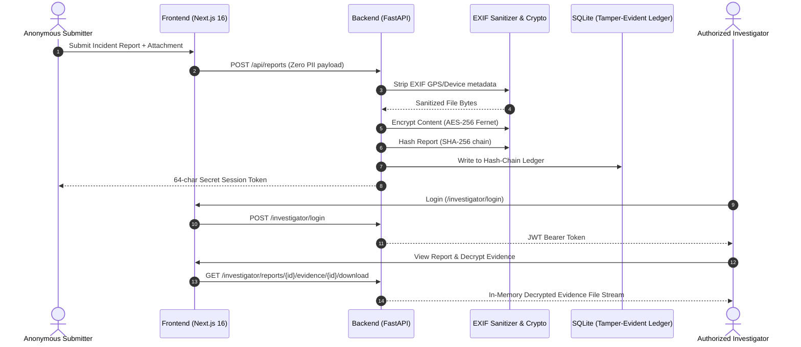

<div align="center">

# 🛡️ TrueChain (SafeVoice)
### *Cryptographically Verifiable & Privacy-First Anonymous Reporting Platform*

[](https://truechain.vercel.app/)
[](https://trust-chain-voice-1.onrender.com)
[](https://truechain.vercel.app/)
[](https://truechain.vercel.app/)
[](https://truechain.vercel.app/)

<p align="center">
  <b>Eliminating fear of workplace retaliation through cryptographic mathematical trust — zero PII, EXIF metadata stripping, AES-256 encryption, and an immutable SHA-256 hash-chain ledger.</b>
</p>

[🚀 Live Demo Links](#-quick-evaluator-testing-guide) • [⚡ TL;DR](#-tldr-for-evaluators) • [🎯 Problem Statement](#-the-problem) • [💡 Architecture](#-system-architecture) • [🔐 Security Specs](#-key-security-innovations) • [🛠️ Tech Stack](#%EF%B8%8F-tech-stack)

---

</div>

## 🚀 Quick Evaluator Testing Guide

Evaluators can test the complete platform end-to-end using our deployed production links:

| Component | Target URL / Quick Action | Evaluator Credentials & Instructions |
|---|---|---|
| 🌐 **Live Web Application** | [`https://truechain.vercel.app/`](https://truechain.vercel.app/) | Primary user interface for anonymous reporting |
| 🕵️ **Investigator Portal** | [`https://truechain.vercel.app/investigator/login`](https://truechain.vercel.app/investigator/login) | **Username:** `sunnypathak979`<br>**Password:** `Sunny@979`<br>*(Alt: `admin` / `changeme123`)* |
| 🔍 **Status Lookup** | [`https://truechain.vercel.app/status`](https://truechain.vercel.app/status) | Test session token:<br>`x9r4_87ww2CW_scMb2c7wtw6CnhyGCx5NC_-h73_WUQ` |
| ⛓️ **Public Chain Audit** | [`https://truechain.vercel.app/verify`](https://truechain.vercel.app/verify) | Live SHA-256 cryptographic tamper verification |
| ⚡ **FastAPI Backend API** | [`https://trust-chain-voice-1.onrender.com`](https://trust-chain-voice-1.onrender.com) | Production REST API & OpenAPI docs |

---

## ⚡ TL;DR for Evaluators

| Dimension | Implementation |
|---|---|
| **🚨 The Problem** | Victims avoid reporting harassment and corruption due to fear of retaliation, IP/device metadata leaks, and silent backend record deletion. |
| **💡 The Solution** | A zero-PII reporting platform featuring **automated EXIF metadata stripping**, **AES report encryption**, and an **immutable cryptographic SHA-256 hash-chain**. |
| **🔐 Structural Trust** | Trust is enforced *structurally* through schema constraints and cryptographic linking — not promised via privacy policy declarations. |
| **📁 Evidence Decryption** | Attached files (images/PDFs) are EXIF-sanitized and AES-encrypted at rest. Authorized investigators decrypt and view evidence directly in-session. |
| **🔍 Independent Verification** | Public `/verify` portal allowing anyone to audit the integrity of the report log chain without credentials. |

---

## 🎯 The Problem

Traditional reporting systems collect implicit or explicit identity vectors (names, emails, employee IDs, device fingerprints, or EXIF metadata). Even when marked "anonymous", submitters face severe risks:

- 📌 **Metadata Leakage:** Uploaded images/documents retain GPS coordinates, camera specs, and creation timestamps.
- 📌 **Systemic Tampering:** Privileged admins or perpetrators can secretly delete or modify backend database rows.
- 📌 **Lack of Verification:** Whistleblowers have no way to prove a report existed or was modified post-submission.

> [!WARNING]
> When anonymity relies on policy rather than architecture, genuine incidents go unreported due to distrust.

---

## 💡 Our Solution & System Workflow

TrueChain transforms reporting from **"Trust Us"** to **"Verify the Math"**.



---

## 🔑 Key Security Innovations

### 1. 🔒 Privacy Enforced at Schema Level
The database schema contains **zero columns** for PII (name, email, IP, user-agent). It is physically impossible to store user identity data in the relational schema.

### 2. 🔗 Append-Only SHA-256 Hash-Chain Ledger
```text
report_hash = SHA256(content + evidence_hash + prev_hash)
```
There is **no `UPDATE` or `DELETE` path** for report contents in the API layer. Any direct database tampering breaks downstream hashes, making corruption instantly detectable on the `/verify` portal.

### 3. 🧼 Transparent Metadata Sanitization
Automated stripping of EXIF data, GPS coordinates, device identifiers, and timestamp headers prior to persistence. The interface displays an interactive **Sanitization Report** showing exact attributes purged.

### 4. 🔑 64-Character Secret Token Case Lookup
Submitters receive a cryptographically generated 64-character token upon submission. They can track case status at `/status` anytime without revealing their identity.

### 5. 🕵️ Authorized Investigator Portal & In-Memory Decryption
Investigators authenticate via JWT. Attached evidence files are stored encrypted at rest and decrypted **in-memory** on request, streaming clean previews/downloads to active investigator sessions.

---

## 🛠️ Tech Stack

### **Frontend**
* **Framework:** Next.js 16 (App Router with Turbopack), React 19
* **Styling:** Tailwind CSS, Radix UI / Shadcn UI components, Framer Motion
* **State & Icons:** Zustand, Lucide React
* **Deployment:** Vercel

### **Backend**
* **Framework:** FastAPI, Uvicorn, Pydantic v2
* **Cryptography:** Cryptography (Fernet AES-256), hashlib (SHA-256), PyPDF, Pillow
* **Authentication:** Python-Jose (JWT), Bcrypt password hashing
* **Database:** SQLite with SQLAlchemy ORM
* **Deployment:** Render (with 1GB persistent storage disk)

---

## 💻 Local Development Setup

### 1. Backend Setup
```bash
cd truechain-backend/backend
python -m venv venv
.\venv\Scripts\activate      # Windows
# source venv/bin/activate  # Linux/Mac
pip install -r requirements.txt
python -m uvicorn main:app --reload --port 8000
```

### 2. Frontend Setup
```bash
cd truechain-frontend5
npm install
npm run dev
```
Open `http://localhost:3000` in your browser.

---

## 🧪 Automated Testing
Run backend unit & smoke tests:
```bash
cd truechain-backend/backend
.\venv\Scripts\python -m pytest tests/ -v
```

---

<div align="center">
  <b>Built for Omni_CyberTech_15 • Cryptographic Trust Engineered for Anonymous Reporting</b>
</div>
